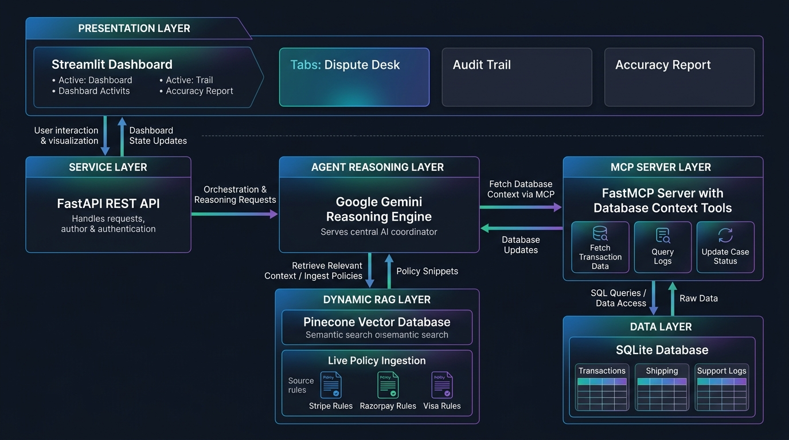

# 🛡️ AI Risk Manager: Autonomous Chargeback & Fraud Dispute Defender

[](https://www.python.org/)
[](https://fastapi.tiangolo.com/)
[](https://streamlit.io/)
[](https://github.com/jlowin/fastmcp)
[](https://ai.google.dev/)
[](https://www.pinecone.io/)
[](LICENSE)

An enterprise-grade, **Multi-Agent Fintech Risk & Chargeback Dispute Defense System**. Rather than relying on rigid black-box classifiers, this platform leverages **Google Gemini reasoning agents** orchestrated via **Model Context Protocol (MCP)** tools and **Pinecone vector retrieval** to autonomously investigate disputes, cite mandatory card network rules (Visa / Mastercard / RBI), compute financial outcomes, and generate legally binding chargeback rebuttal packages.

---

## 📸 Key Capabilities

* **🤖 Tri-Agent Collaborative Reasoning**:
  * **Evidence Agent**: Queries read-only database tools (carrier telemetry, IP logs, customer chat transcripts, order history).
  * **Policy/Rubric Agent**: Evaluates compliance against live network rules (Visa Compelling Evidence 3.0, RBI 2FA mandates).
  * **Legal Drafter**: Composes formal, court-admissible chargeback defense letters.
* **🔌 Model Context Protocol (MCP) Integration**: Isolated, secure, read-only database tools exposing structured customer telemetry directly to the AI agent.
* **🌲 Dynamic Policy Knowledge Base**: Ingests authoritative card network rules & merchant refund policies into Pinecone Vector DB using `multilingual-e5-large` embeddings.
* **📊 Fintech Analytics Dashboard**: Streamlit-powered high-contrast command center featuring a circular glowing confidence dial, live tool execution logs, and dispute triage queue.
* **📈 Empirical Evaluation Suite**: Full benchmark harness tracking Accuracy, Precision, Recall, F1 Score, and Cost-Weighted ROI across held-out test sets.

---

## 🏛️ System Architecture



---

## 📂 Repository Structure

```text
AI-Risk-Manager/
├── .github/
│   └── workflows/
│       └── ci.yml              # Automated CI workflow (build, seed DB & run tests)
├── docs/                       # Architectural & Technical Documentation
│   ├── 01_problem_statement.md # Problem statement, requirements & domain context
│   ├── 02_architecture.md      # Comprehensive System Architecture & Data Flow
│   ├── 03_implementation.md    # Technical prompt construction & tool flows
│   └── 04_edge_cases.md        # 12 Failure Modes of LLM Classifiers & Mitigations
├── data/                       # Static policy registries & seed data
│   └── policy_sources.json     # Authoritative policy definitions & regulatory text
├── src/                        # Core Application Source Code
│   ├── __init__.py             # Python package identifier
│   ├── agent.py                # Multi-agent Gemini reasoning pipeline & rebuttal drafter
│   ├── database.py             # SQLite schema, connection pool & migrations
│   ├── mcp_server.py           # FastMCP read-only tool server for safe DB queries
│   ├── policy_engine.py        # Pinecone vector retrieval & local fallback engine
│   └── policy_sync.py          # Vector ingestion pipeline for Pinecone DB
├── scripts/                    # Standalone Utilities & Generators
│   ├── generate_data.py        # Synthetic dataset & realistic dispute seed generator
│   └── verify_links.py         # External policy URL link health checker
├── tests/                      # Testing & Benchmarking Suite
│   ├── __init__.py             # Test package identifier
│   ├── test_service.py         # FastAPI endpoint integration test suite
│   └── evaluate.py             # Empirical accuracy & cost-weighted ROI benchmark
├── app.py                      # Interactive Streamlit Fintech Dashboard (Frontend)
├── main.py                     # FastAPI REST API Service Layer (Backend)
├── .env.example                # Safe environment variable configuration template
├── .gitignore                  # Git exclusion rules (secrets, databases, caches)
├── requirements.txt            # Python package dependencies
├── LICENSE                     # MIT Open Source License
└── README.md                   # Project documentation and quickstart guide
```

---

## 🚀 Quickstart & Installation

### 1. Prerequisites
* Python 3.10, 3.11, or 3.12
* [Google AI Studio API Key](https://aistudio.google.com/)
* [Pinecone API Key](https://app.pinecone.io/) (Optional, policy engine contains graceful local fallback)

### 2. Clone the Repository
```bash
git clone https://github.com/your-username/AI-Risk-Manager.git
cd AI-Risk-Manager
```

### 3. Create & Activate Virtual Environment
```bash
# Linux / macOS
python3 -m venv .venv
source .venv/bin/activate

# Windows (PowerShell)
python -m venv .venv
.venv\Scripts\Activate.ps1
```

### 4. Install Dependencies
```bash
pip install -r requirements.txt
```

### 5. Configure Environment Variables
Copy the `.env.example` template to `.env` and fill in your API credentials:
```bash
cp .env.example .env
```
Edit `.env`:
```env
GEMINI_API_KEY=your_gemini_api_key_here
PINECONE_API_KEY=your_pinecone_api_key_here
PINECONE_INDEX_NAME=chargeback-policies
```

### 6. Initialize Database & Seed Synthetic Disputes
```bash
python scripts/generate_data.py
```

### 7. (Optional) Ingest Policy Rules to Pinecone Vector DB
```bash
python src/policy_sync.py
```

---

## 🖥️ Running the Application

### Option A: Start the Streamlit Dashboard (Frontend UI)
```bash
streamlit run app.py
```
> The dashboard will open in your browser at `http://localhost:8501`.

### Option B: Run the FastAPI Service Layer (Backend REST API)
```bash
uvicorn main:app --reload --port 8000
```
> Access interactive Swagger API documentation at `http://localhost:8000/docs`.

### Option C: Run the FastMCP Server Directly
```bash
python src/mcp_server.py
```

---

## 🧪 Testing & Evaluation

### Run API & Integration Tests
```bash
python tests/test_service.py
```

### Run Model Evaluation & ROI Benchmark
```bash
python tests/evaluate.py
```

---

## 📚 In-Depth Documentation

For detailed technical specifications, explore the [`docs/`](docs/) directory:
* [Problem Statement](docs/01_problem_statement.md) — Domain context on chargeback fraud and payment rails.
* [System Architecture](docs/02_architecture.md) — Multi-tier design, data schema, and security model.
* [Implementation Plan](docs/03_implementation.md) — Technical details of prompt construction and tool flows.
* [Edge Cases & Mitigations](docs/04_edge_cases.md) — 12 critical LLM failure modes vs. classical classifiers.

---

## 📄 License

This project is licensed under the [MIT License](LICENSE).
